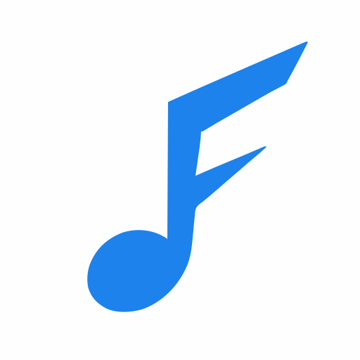

# 🎵 FREQ

음악 평가 및 리뷰 플랫폼

<div align="center">



**음악을 평가하고, 리뷰를 작성하고, 다른 음악 애호가들과 소통하세요**

[](https://react.dev/)
[](https://www.typescriptlang.org/)
[](https://vitejs.dev/)

</div>

---

## ✨ 주요 기능

- 🎼 **음악 평가**: 앨범과 트랙에 대한 평점 및 리뷰 작성
- 📝 **컬렉션 관리**: 나만의 음악 컬렉션 생성 및 공유
- 👥 **소셜 기능**: 다른 사용자 팔로우, 리뷰 좋아요, 댓글 작성
- 🔍 **검색**: 앨범, 트랙, 아티스트 검색
- 📊 **통계**: 평가 분포 및 활동 내역 확인
- 🔔 **알림**: 팔로우, 좋아요, 댓글 등 실시간 알림

## 🚀 시작하기

### 필수 요구사항

- Node.js 18 이상
- npm 또는 yarn

### 설치

```bash
# 의존성 설치
npm install
```

### 개발 서버 실행

```bash
# 개발 모드로 실행
npm run dev
```

개발 서버가 시작되면 브라우저에서 `http://localhost:5173` (또는 표시된 포트)로 접속하세요.

### 프로덕션 빌드

```bash
# 프로덕션 빌드 생성
npm run build
```

빌드된 파일은 `dist` 폴더에 생성됩니다.

## 🛠 기술 스택

### 핵심 기술
- **React 18** - UI 라이브러리
- **TypeScript** - 타입 안정성
- **Vite** - 빌드 도구 및 개발 서버
- **React Router** - 클라이언트 사이드 라우팅

### UI 컴포넌트
- **Radix UI** - 접근성 높은 UI 컴포넌트
- **Tailwind CSS** - 유틸리티 기반 CSS
- **Lucide React** - 아이콘 라이브러리

### 상태 관리 & 데이터 페칭
- **TanStack Query** - 서버 상태 관리
- **React Context** - 전역 상태 관리 (인증)

### 폼 관리
- **React Hook Form** - 폼 상태 관리 및 검증

### 차트
- **Recharts** - 데이터 시각화

## 📁 프로젝트 구조

```
freq-web/
├── public/              # 정적 파일
├── src/
│   ├── api/            # API 클라이언트 및 타입 정의
│   ├── assets/         # 이미지, 폰트 등
│   ├── components/     # 재사용 가능한 컴포넌트
│   ├── contexts/       # React Context (인증 등)
│   ├── hooks/          # 커스텀 훅
│   ├── pages/          # 페이지 컴포넌트
│   ├── services/       # 비즈니스 로직
│   ├── styles/         # 전역 스타일
│   ├── types/          # TypeScript 타입 정의
│   ├── utils/          # 유틸리티 함수
│   ├── App.tsx         # 메인 앱 컴포넌트
│   └── main.tsx        # 진입점
├── index.html
├── package.json
└── vite.config.ts
```

## 🔐 인증

FREQ는 다음 소셜 로그인을 지원합니다:
- 이메일/비밀번호
- 구글 로그인
- 카카오 로그인
- 네이버 로그인

## 📄 라이선스

이 프로젝트는 비공개 프로젝트입니다.

## 📧 문의

프로젝트에 대한 문의사항이 있으시면 이메일로 연락해주세요.

---

<div align="center">

**Made with ❤️ for music lovers**

</div>
